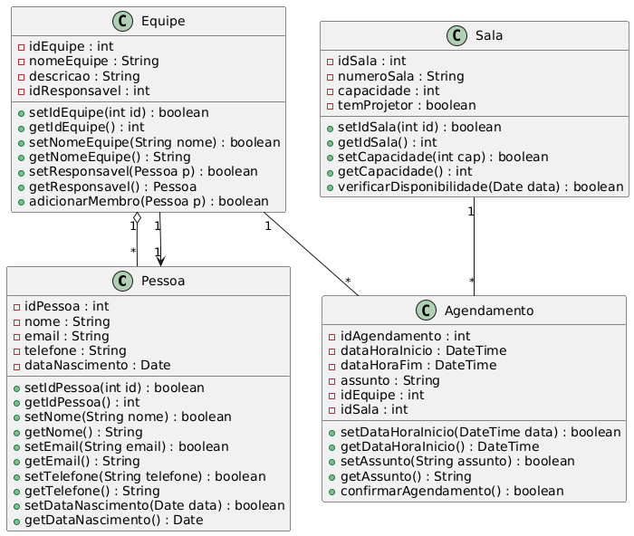

# 🧩 Escape Room — Manager System

Frontend em React (Vite) + Ant Design + JavaScript (ESM)
Projeto de **aplicação web completa** para gerenciamento de um **Escape Room**, contemplando CRUDs de **Agendamentos**, **Salas** e **Equipes**, além de um **Dashboard Analítico** com validações de conflito de horário e persistência via **LocalStorage**.

---

## 🌐 Deploy da Aplicação

**Frontend (Produção):**
🔗 Vercel: [(https://escape-room-system.vercel.app/)]


## 📦 Repositórios

**Frontend (ReactJS):** 🔗 [https://github.com/thamihllo/ESCAPE-ROOM-SYSTEMV1]

---

## 🧭 Visão Geral

- **Domínio:** Gerenciamento de Entretenimento (Escape Room)
- **Entidades Principais:** Agendamento, Sala, Equipe
- **Objetivo:** Desenvolver uma interface administrativa (Dark Mode) para controle de ocupação e faturamento, sem dependência de Backend externo, focando em lógica no cliente (Client-Side Logic).
- **Persistência:** LocalStorage (Simulação de Banco de Dados), com acesso via padrão DAO.

---

## 🚀 Tecnologias Utilizadas

**Frontend**

- React JS (Vite)
- JavaScript (ES Modules)
- Ant Design (AntD)
- Day.js (Manipulação de Datas)
- Lucide React (Ícones)
- CSS Modules / Inline Styles

---

## 🎯 Desafio Atendido (CRUDs + Relacionamentos)

O projeto atende integralmente aos desafios de lógica e interface, incluindo:

✅ **Dashboard Interativo** com KPIs financeiros
✅ **CRUD de Salas** com precificação dinâmica
✅ **CRUD de Equipes** com controle de participantes
✅ **Smart Booking** (Sistema que impede choque de horários)
✅ **Robô de Limpeza** (Atualização automática de status de reservas passadas)
✅ **Persistência em LocalStorage** com padrão DAO

---

## 📋 Requisitos Funcionais (RF)

**Dashboard e Métricas**
- **RF01** — Visualizar Faturamento Mensal e Ticket Médio
- **RF02** — Acompanhar Taxa de Ocupação e Eficiência da Agenda
- **RF03** — Visualizar lista de últimas atividades (Feed)

**Agendamentos**
- **RF04** — Realizar novos agendamentos
- **RF05** — Bloquear horários fora do expediente (13h às 23h)
- **RF06** — Impedir conflitos de horário na mesma sala
- **RF07** — Cancelar ou editar reservas

**Gestão Administrativa**
- **RF08** — Cadastrar Salas (com preço Padrão vs. Promocional)
- **RF09** — Listar e editar Salas
- **RF10** — Cadastrar Equipes e validar limite de participantes (Máx: 8)
- **RF11** — Listar e gerenciar Equipes

---

## ⚙️ Requisitos Não Funcionais (RNF)

- **RNF01** — Aplicação desenvolvida em ReactJS com Vite
- **RNF02** — Interface construída com Ant Design (Tema Dark)
- **RNF03** — Comunicação e persistência via LocalStorage
- **RNF04** — Uso do padrão DAO (Data Access Object) para isolar a lógica de dados
- **RNF05** — Interface responsiva
- **RNF06** — Validação de formulários e feedback visual (Toasts)
- **RNF07** — Código organizado por componentes e responsabilidades

---

## 🖼️ Telas da Aplicação

As telas abaixo ilustram as principais funcionalidades do sistema.

**Tela 1 — Dashboard Analítico**


**Tela 2 — Agendamento Inteligente**


**Tela 3 — Gerenciamento de Salas**


**Tela 4 — Gestão de Equipes**


🧠 Modelagem dos Dados

📌 Diagrama de Classes

O diagrama de classes abaixo representa o modelo conceitual utilizado no projeto, servindo como base para o Backend/LocalStorage e para o consumo no FrontEnd.





### 📂 Estrutura de Pastas

```text
projeto/
├── public/
│   ├── classes.imag.png
│   └── vite.svg
├── src/
│   ├── assets/            # Imagens do sistema
│   ├── components/        # Componentes visuais (CrudTable, Cards)
│   ├── daos/              # Lógica de persistência (LocalStorageDAO)
│   ├── pages/             # Telas (Dashboard, Salas, Agendamentos...)
│   ├── App.css
│   ├── App.jsx            # Rotas e Layout
│   ├── index.css
│   └── main.jsx
├── .gitignore
├── eslint.config.js
├── index.html
├── package-lock.json
├── package.json
├── README.md
└── vite.config.js
▶️ Execução Local

Bash

# Instalar dependências
npm install
# Rodar o projeto
npm run dev


## 🎯 Objetivos de Aprendizado

Este projeto permite praticar:

* **Organização modular** com React
* **Uso avançado de hooks** (`useState`, `useEffect`, `useMemo`)
* **Componentização profissional** com Ant Design
* **Implementação de Lógica de Negócio complexa** no Frontend (Validação de datas e conflitos)
* **Persistência de dados** utilizando `LocalStorage` e padrão DAO
* **Manipulação de datas** com Day.js

---

## 👥 Autoria

👤 Autor:Thamires Fernandes Borges

   Projeto:Escape Room Manager System V1

   Área:Desenvolvimento FrontEnd

🎓 Instituição: Instituto Federal de Brasília (IFB)
